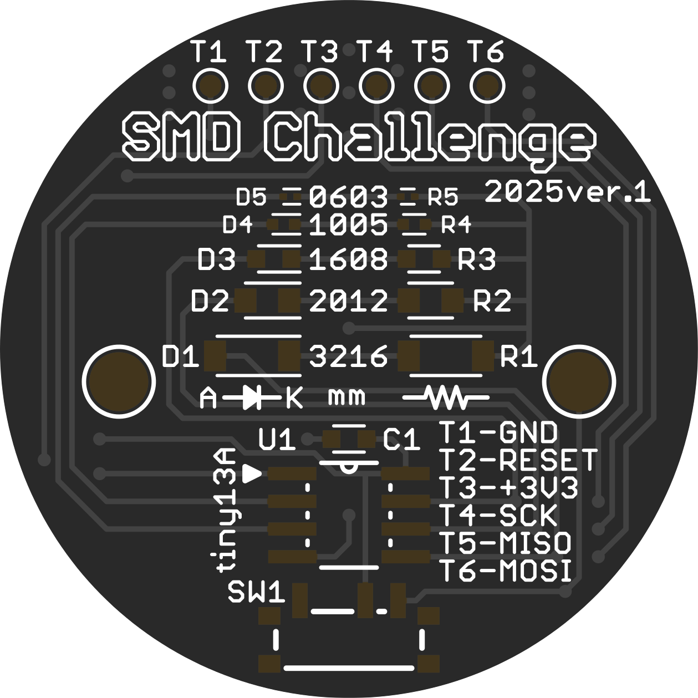
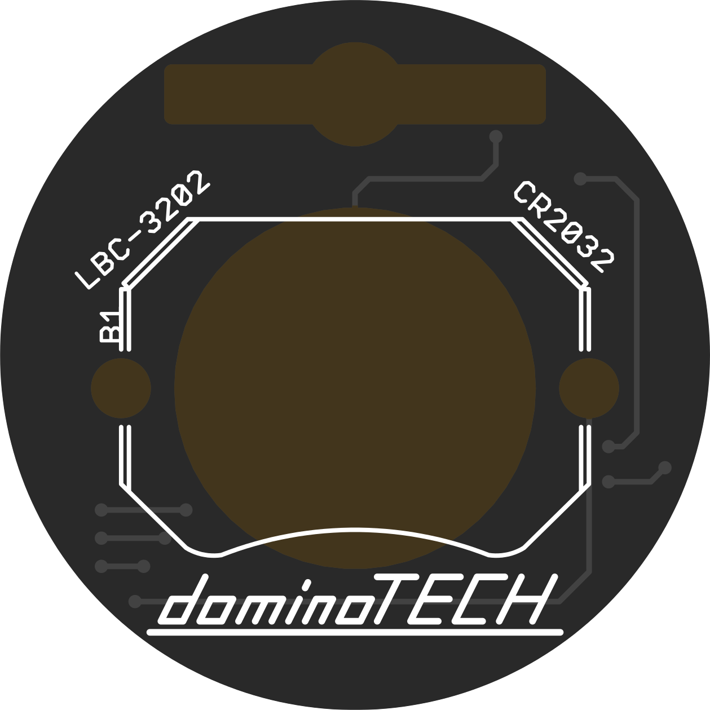

# SMD Challenge Badge

# SMD_Challenge

このプロジェクトは、aspro648の[Attiny85Challenge](https://github.com/aspro648/KiCad/tree/master/projects/Attiny/Attiny85Challenge)を基に改変したもので、Creative Commons Attribution-ShareAlike 3.0 United States (CC BY-SA 3.0 US) ライセンスの下で公開されています[https://creativecommons.org/licenses/by-sa/3.0/us/](https://creativecommons.org/licenses/by-sa/3.0/us/)  
また、https://www.tindie.com/products/makersbox/smd-challenge を参考にしています。

## ライセンス
このプロジェクトはCC BY-SA 3.0 USライセンスに従います。  
派生作品も同一ライセンスで公開する必要があります。詳細は[LICENSEファイル](LICENSE.md)をご覧ください。

## 変更点
- LEDの配置を変更し、視認性を向上。
- マイコンをATtiny85からATtiny13Aに変更
- スイッチの追加

## クレジット
- オリジナルプロジェクト: aspro648 Attiny85Challenge (https://github.com/aspro648/KiCad/tree/master/projects/Attiny/Attiny85Challenge)
- 参考製品: Maker's Box SMD Challenge (https://www.tindie.com/products/makersbox/smd-challenge)

**SMD Challenge Badge**は、あなたの表面実装部品をはんだ付けスキルを試す究極のキットです！  
ゴマより小さな0603（0.6mm x 0.3mm）のLEDをはんだ付けして、技術と忍耐の限界に挑戦しましょう。  
このキットは、[Hackaday.ioの"An Unfortunate SMD Project"](https://hackaday.io/project/25265-an-unfortunate-smd-project)を参考に、部品や基板パターンを改良して再構築したものです。  
上級者向けですが、初心者も大歓迎！さあ、挑戦する覚悟はできていますか？

## 特徴
- **極小サイズの挑戦**: 0603サイズのLEDと抵抗をはんだ付け。
- **達成感抜群**: 完成すれば、胸を張ってつけられるカッコいいバッジが手に入ります！
- **初心者からプロまで**: 上級者向けキットですが、初心者でも挑戦可能。
- **SNSで自慢**: 完成したバッジを[#SMD_Challenge](https://twitter.com/hashtag/SMD_Challenge)で投稿して、世界にあなたのスキルをアピール！

## キット内容

SMD Challenge Badgeのキット内容は以下の通り。

| 部品名           | 詳細                              | 数量             | 型番              |
|------------------|-----------------------------------|------------------|-------------------|
| **抵抗**         | R1: 3216 1kΩ                     | 1個              | WR12X102 JTL      |
|                  | R2: 2012 1kΩ                     | 1個              | WR08X102 JTL      |
|                  | R3: 1608 1kΩ                     | 1個              | WR06X102 JTL      |
|                  | R4: 1005 2.2kΩ                   | 1個              | WR04X222 JTL      |
|                  | R5: 0603 1kΩ（予備1個）          | 1個 + 予備1個    | WR02X102 JAL      |
| **LED**          | D1: 3216 赤 639nm                 | 1個              | LTST-C150KRKT     |
|                  | D2: 2012 橙 605nm                 | 1個              | OSO50805C1C       |
|                  | D3: 1608 黄 591nm                 | 1個              | OSYL1608          |
|                  | D4: 1005 緑 525nm                 | 1個              | OSG50402C1C       |
|                  | D5: 0603 青 470nm（予備1個）      | 1個 + 予備1個    | OSB50201C1E       |
| **コンデンサ**   | C1: 1608 0.1µF                    | 1個              | GCM188L81H104KA57 |
| **マイコン**     | U1: ATtiny13A 8SOIC               | 1個              | ATTINY13A-SS7     |
| **スイッチ**     | SW1: SSSS811101 または CUS-12TB   | 1個              | CUS-12TB          |
| **電池ホルダ**   | B1: BK-913（スルーホール）        | 1個              | BK-913            |
| **電池**         | CR2032(テスト用）                 | 1個              |                   |
| **バッジ金具**   | 貴和製作所 ウラピンNo.101         | 1個              | ウラピンNo.101    |
| **基板**         | LBC-3202（直径32mm、FR4）         | 1個              | LBC-3202          |
| **糸はんだ**     | 0.3mm（約30cm、サンプル用）       | 1本              |                   |
| **説明書**       | Manual ver2.2                     | 1枚              |                   |

## **※注意**
- サンプル用の糸はんだは少量です。不足する場合は別途ご用意ください。
- 0603サイズのSMD部品には予備が含まれます。余った場合は…眺めて楽しんで！

## 基板仕様
- **型番**: LBC-3202
- **外形**: 32mm
- **厚み**: 1.6mm
- **材質**: FR4-Standard TG 135-140
- **表面処理**: 有鉛はんだ（RoHS非対応）
- **ピンのピッチ**: T1-T6（マイコン書き込み用）は2.54mm

## 基板設計

SMD Challenge Badgeの基板は、挑戦者の心を掴む設計で作られています！挑戦の舞台裏を覗いてみよう！

- **設計ツール**: EAGLE 6.6.0 Professionalを使用  
(元のAttiny85ChallengeはKiCadで設計されていますが、本プロジェクトではEAGLEに変換して再設計しました。EAGLEの使い慣れた環境とレイアウト最適化のために選択)
- **ガーバーデータ**: [Gerberフォルダ](Gerber)に提供しています。CC BY-SA 3.0 USライセンスに従い、個人使用および商用利用が可能です。ただし、派生作品も同一ライセンスで公開してください。
- **基板サイズ**: 直径32mmの円形で、缶バッジと同じサイズ感を狙った！。胸に輝くバッジに最適！
- **パターン幅**: 0.254mm（10mil）で設計
- **設計のこだわり**: 0.254mmパターンで0603部品の安定実装と手作業の限界を両立。円形基板で缶バッジ風の見た目を追求！

※ガーバーデータは[Gerberフォルダ](Gerber)にあります。SVG版も[SVGフォルダ](SVG)で公開しています。気軽に基板パターンを眺めたい人はSVGをチェック！

 

## 必要な工具
- **はんだごて**: コテ先は尖ったものがおすすめ（例: HAKKO FX-600）。
- **鉛入りはんだ**: 0.3mmの細いもの（例: “HOZAN H-712” “千住金属工業 RMA98SUPER-P3-SN60-0.3”など）が最適
- **フラックス**: 普段使っているものでOK
- **高級ピンセット**: 小さな部品をしっかりつかめるもの
- **拡大鏡または実体顕微鏡**: 作業が格段に楽になります。なければ100円ショップのルーペなどでも良いと思います
- **たくさんの忍耐、持続力、そして前向きな姿勢！**　失敗しても大丈夫、チャレンジを楽しもう！

## 組み立てガイド
詳細な組み立て手順は、以下のリンクを参照してください：
- [組み立て説明書](Manual/SMD_Challenge_Badge_Manual_ver2.3.pdf)

動作確認動画  

### 製作のポイント
1. **表面（TOP）から開始**: 裏面から始めると難易度が跳ね上がります！
2. **大きい部品から**: 3216→2012→1608→1005→0603の順で。大きいSMD部品から始めるとモチベーションを保ちやすいです。
3. **LEDの極性に注意**: 逆向きだと光りません（50:50の運試し！）。カソードの向きは説明書を参考に。
4. **LEDの取り扱い**: 樹脂部をピンセットで強く押さえないで。傷や断線で点灯不良の原因に。
5. **スイッチ（SW1）**: 熱に注意し慎重にはんだ付け。
6. **パスコン（C1）**: マイコンより先にはんだ付け。
7. **マイコン（U1）**: 向きを確認し正確に実装。
8. **裏面実装**: 電池ホルダ（B1）とウラピンNo.101を向きに注意してはんだ付け。  
ウラピンはピンを開き、基板裏面を上にして針を右側、止め金具を左側にセット！
9. **フラックス除去**: フラックスクリーナー（例: FL-500）やイソプロピルアルコールで洗浄して完成！

※SMD部品の開封はキット付属の薄い袋の中で行うと、紛失リスクを少し軽減できます。

## 完成したら
- **SNSで投稿**: Twitterやその他のSNSで[#SMD_Challenge](https://twitter.com/intent/tweet?hashtags=SMD_Challenge)を付けて投稿！  
成功も失敗も、コミュニティでシェアしよう！
- **挑戦の証**: 完成したバッジを胸に、はんだ付けの「狂人」として誇示！

## 注意事項
- **電池の向き**: CR2032はマイナス面が基板側。
- **RoHS非対応**: 鉛入りはんだを使用。取り扱いに注意。
- **0603のLEDは非常に脆い**: 完成後はUVレジンやケースで保護を。

推奨ケース
- [明邦化学工業 ラウンドケース S 5段 クリア](https://meihokagaku.co.jp/?p=2736)
- [ラウンドケースS　フタ](https://meihokagaku.co.jp/?p=2709)

## オリジナルとの改良点

SMD Challenge Badgeは、[Hackaday.ioの"An Unfortunate SMD Project"](https://hackaday.io/project/25265-an-unfortunate-smd-project)に敬意を表しつつ、使いやすさと耐久性を追求して進化させました！以下は、本家との主な違い：

- **LED配置を逆転**: 壊れやすい0603サイズのLEDを一番安全な場所に移動。極小パーツを守るための戦略的配置！
- **基板サイズの拡大**: 本家よりゆったり設計で、作業スペースを確保。はんだ付けのストレスが少し軽減！
- **電源スイッチの追加**: 本家にはないスライドスイッチを搭載。電源のON/OFFが簡単で、バッジの輝きをコントロール！
- **缶バッジ風金具**: 本家のピンバッジから、缶バッジと同じような金具へ変更。装着感も個性もアップ！
- **マイコンの変更**: 本家のATtiny85からATtiny13Aに変更。ATtiny13Aは低コストで同等のパフォーマンスを提供し、入手性がとても良いので採用。
- **電池ホルダをスルーホールに**: SMDの電池金具は剥がれやすいので、スルーホール型に変更。ガッチリ固定で頑丈に！

これらの改良で、挑戦のスリルはそのままに、初心者から上級者まで楽しめるキットに仕上げました！

## サポート
質問やサポートが必要な場合は、[dominodaosi106](https://twitter.com/dominodaosi106)か説明書のメールアドレスからお問い合わせください。  
また、コミュニティで[#SMD_Challenge](https://twitter.com/hashtag/SMD_Challenge)をチェックして、他の挑戦者と交流しましょう！

## よくある質問
### **部品をなくした！**
- 0603は飛んでいきがち。0603LEDは秋月へ。型番:OSB50201C1E(販売コード:118279)
- 0603は飛んでいきがち。0603抵抗はDigiKeyへ。型番:[WR02X102](https://www.digikey.jp/ja/products/detail/walsin-technology-corporation/WR02X102-JAL/13238943)※[マルツ](https://www.marutsu.co.jp/pc/i/35771794/)でも入手可能
- LEDが光らない？: 極性ミスはSMDの洗礼。説明書やテスターでカソードを確認！
- おすすめのはんだごては？: HAKKO FX-600にT18-C1やT18-ISがオススメ!
- **実体顕微鏡がない！**: 100円ショップのルーペでも代用可。根気でカバー！

---

## [バッジを完成させた人物の一覧](COMPLETERS.md)

---

**はんだごてを握り、SMDの極小世界に挑もう！**  
0603を制覇すれば、あなたも「はんだ付けの狂人」の仲間入り！どこまでできるか、挑戦しよう！